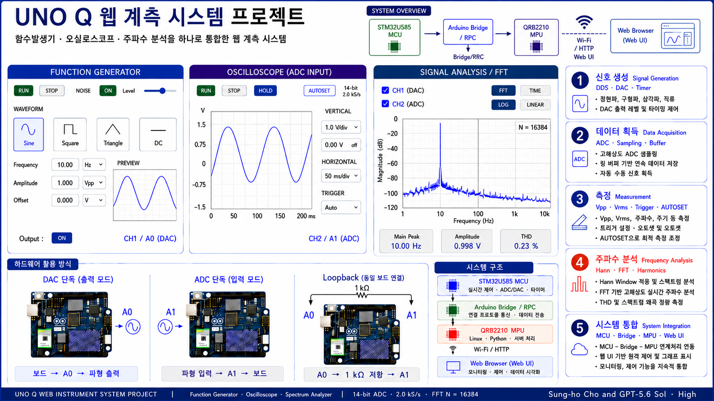

# Arduino UNO Q Function Generator, Oscilloscope & FFT Spectrum Analyzer

A web-based function generator, oscilloscope, and FFT spectrum analyzer built for the Arduino UNO Q.

This project combines the STM32 MCU, Arduino Bridge, MPU-side Python backend, and browser-based Web UI for real-time signal generation, acquisition, measurement, FFT analysis, and visualization.

## Key Features

- Function Generator using DAC output
- Oscilloscope using ADC input
- FFT Spectrum Analyzer
- Real-time Web UI
- Arduino UNO Q MCU–MPU architecture
- ADC sampling at 2 kS/s
- DAC timer at 10 kHz
- FFT size: 16,384 samples
- Multi-browser shared control
- Network performance diagnostics

## Technical Notes — v19.52

### Lean `/api/status` diagnostic output

v19.52 keeps the v19.51 acquisition, analysis, rendering, LIVE recovery, shared-control, network-diagnostic, and lean `/api/samples` behavior unchanged while hiding legacy DMA-development fields from `/api/status` output.

### v19.52 Changes

- `/api/status` now omits top-level `dma_*` and `adc_dma_*` development/diagnostic fields from its JSON output.
- The internal `state` and all DMA-related runtime/source code remain unchanged.
- `/api/samples` remains in the lean v19.51 form.
- No HTML behavior, MCU acquisition, Bridge transport, or MPU analysis algorithm was changed.

### Network Diagnostics

A new `network` object reports a rolling 5 s view of the existing HTTP/API traffic:

- `active_clients`: estimated number of active computers
- `http_rps`: JSON/API responses per second
- `samples_rps`: `/api/samples` responses per second
- `analysis_rps`: `/api/analysis` responses per second
- `control_rps`: POST/control responses per second
- `status_rps`: `/api/status` responses per second
- `json_tx_kib_s`, `json_tx_mbps`: JSON response-body throughput
- rolling average/max response times
- cumulative `total_http_requests` and `total_json_tx_bytes`

The active-client estimate is based on remote IP so classroom tests can record the number of connected computers without adding browser IDs or changing the browser polling protocol.

### Diagnostic Overhead Policy

- No new polling loop
- No new worker thread
- Existing requests only update small counters/timestamps and a bounded 5 s deque
- Network diagnostics use a separate lock and do not change the ADC/server-ring lock path
- Static HTML transfer is excluded from steady-state JSON/API throughput

### Preserved Behavior

- Shared controls across browsers
- LIVE recovery when browser lag exceeds 1.0 s
- Spectrum display from 0.2 Hz
- Bridge RPC batch: 256
- ADC: 2 kS/s
- DAC timer: 10 kHz
- TIME display: 25 fps
- MEASURE + COMPARE: 2 Hz
- FFT: 2 Hz
- FFT size: 16,384 samples
- 250 ms analysis staggering
- `python/analysis_engine.py` and `sketch/sketch.ino` signal-processing/acquisition behavior unchanged
